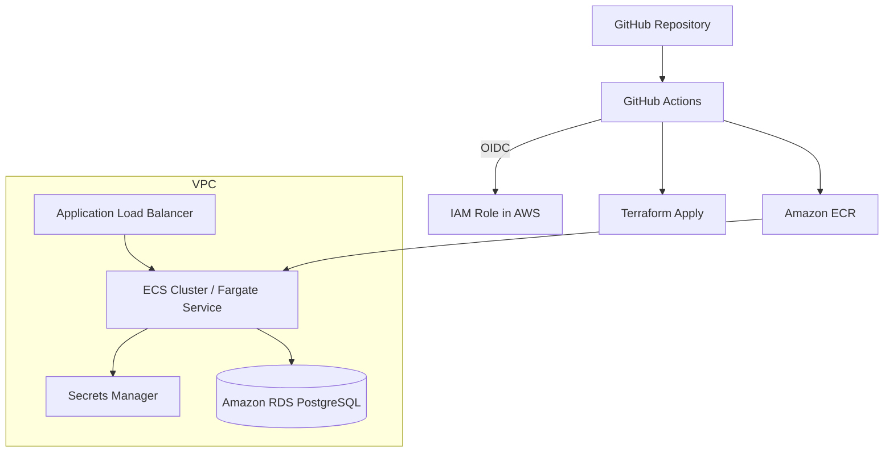

# Architecture Diagram

## High-level explanation

- Developers push code to GitHub.
- GitHub Actions deploys to `test` or `prod` depending on the branch.
- The application image is stored in ECR.
- Terraform provisions or updates the infrastructure.
- ECS Fargate runs the containerized application.
- Secrets Manager stores sensitive values.
- RDS runs in private subnets.
